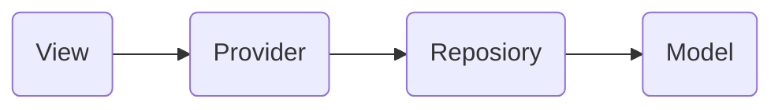
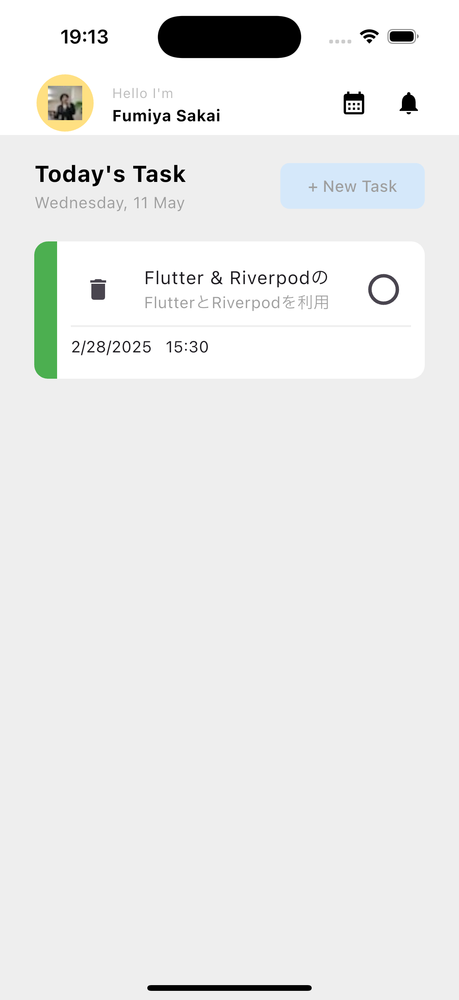
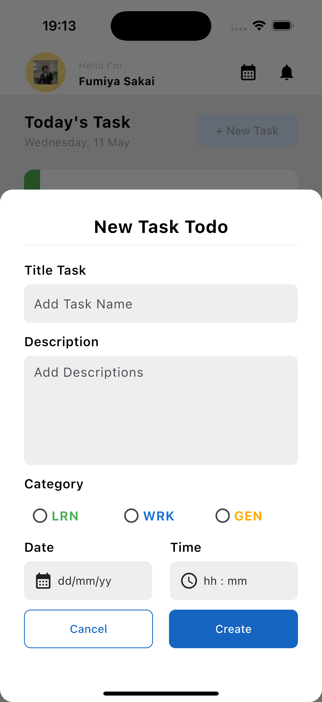
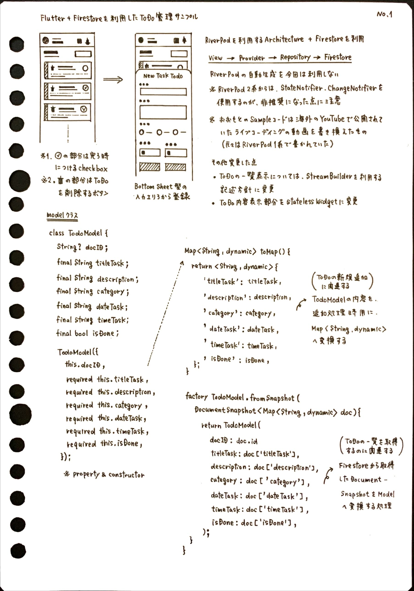
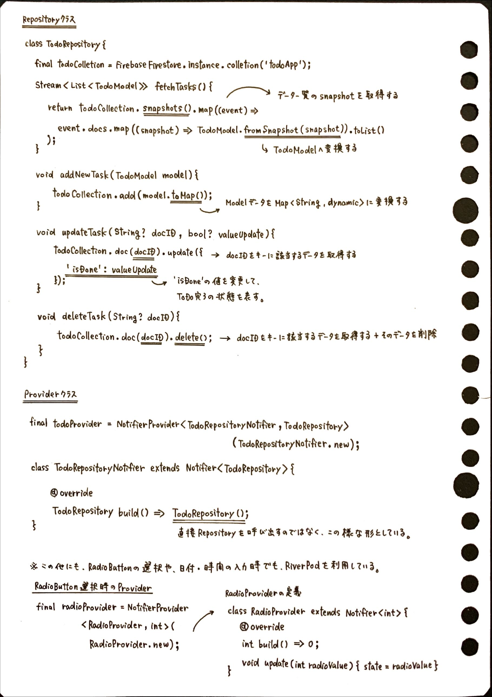
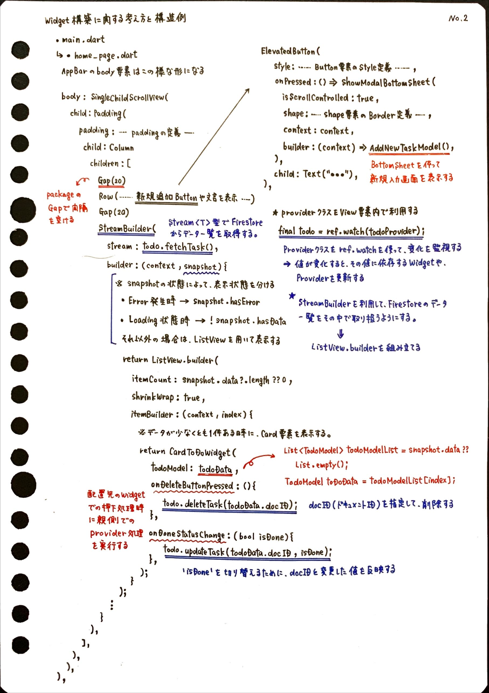
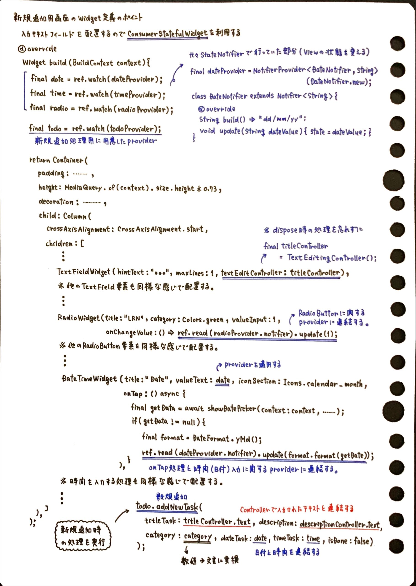
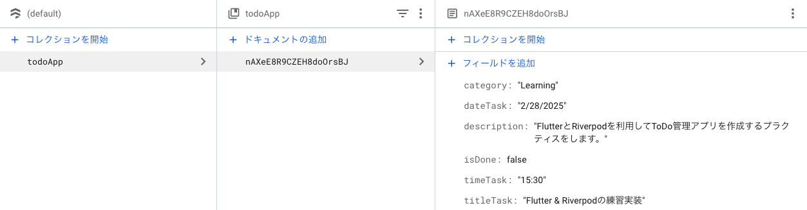

# New Rivepod & Firestore Todo List Example

## 📄 概要

動画で解説されていたサンプルを元にして、Riverpod + Firestoreを連携する処理部分を、最新バージョンRiverpodを利用して書き直し＆リファクタリングを実施したサンプルになります。

__【参考にした動画サンプル】__

https://www.youtube.com/watch?v=X7TTK9T77fo

### 1. 想定アーキテクチャ概要



### 2. 画面スクリーンショット

 

### 3. サンプル構築の際に利用したもの

__【サンプルで利用したパッケージ】__

- flutter_riverpod:
    - 状態管理
    - https://pub.dev/packages/flutter_riverpod
- firebase_core:
    - Firebase Flutterに必要なプラグイン
    - https://pub.dev/packages/firebase_core
- cloud_firestore:
    - Cloud Firestoreを利用するために必要なプラグイン
    - https://pub.dev/packages/cloud_firestore
- gap:
    - RowやColumn等に対して適切な方向に指定したMarginを入れる
    - https://pub.dev/packages/gap
- intl:
    - 言語設定によってテキストを出し分ける
    - https://pub.dev/packages/intl

## 🍅️ ポイント解説

__【サンプルにおける重要部分をまとめたノート】__









## 🎨 StateProvider定義部分の書き換え

元のサンプルでは、ラジオボタン・日付選択・時間選択処理で`StateProvider`を利用していました。
しかしながら、Riverpod2.0以降ではこの書き方は非推奨となったため、このサンプルでは下記の様な形で書き直しを実施しています。

__【Before】__

```dart
final radioProvider = StateProvider<int>((ref) {
  return 0;
});

final dateProvider = StateProvider<String>((ref) {
  return "dd/mm/yy";
});

final timeProvider = StateProvider<String>((ref) {
  return "hh : mm";
});

// 👉 ラジオボタン選択処理用のProvider利用箇所での処理
// ref.read(radioProvider.notifier).update((state) => 1);

// 👉 日付選択処理用のProvider利用箇所での処理
// ref.read(dateProvider.notifier).update((state) => format.format(getDate));

// 👉 時間選択処理用のProvider利用箇所での処理
// ref.read(timeProvider.notifier).update((state) => getTime.format(context));
```

__【After】__

```dart
final radioProvider = NotifierProvider<RadioNotifier, int>(RadioNotifier.new);
class RadioNotifier extends Notifier<int> {
  @override
  int build() => 0;
  void update(int radioValue) {
    state = radioValue;
  }
}

final dateProvider = NotifierProvider<DateNotifier, String>(DateNotifier.new);
class DateNotifier extends Notifier<String> {
  @override
  String build() => "dd/mm/yy";
  void update(String dateValue) {
    state = dateValue;
  }
}

final timeProvider = NotifierProvider<TimeNotifier, String>(TimeNotifier.new);
class TimeNotifier extends Notifier<String> {
  @override
  String build() => "hh : mm";
  void update(String timeValue) {
    state = timeValue;
  }
}

// 👉 ラジオボタン選択処理用のProvider利用箇所での処理
// ref.read(radioProvider.notifier).update(1);

// 👉 日付選択処理用のProvider利用箇所での処理
// ref.read(dateProvider.notifier).update(format.format(getDate));

// 👉 時間選択処理用のProvider利用箇所での処理
// ref.read(timeProvider.notifier).update("hh : mm");
```

## 🔋 Todo処理部分の構築に関して

Todo一覧表示をする処理についても`StateNotifier`を利用したため、`Stream`を利用する形に書き換えを実施しています。

__【Firestore内でのDocument定義】__



__【todo_repository.dart】__

```dart
import 'package:cloud_firestore/cloud_firestore.dart';
import 'package:todo_style_example_app/model/todo_model.dart';

class TodoRepository {
  final todoCollection = FirebaseFirestore.instance.collection('todoApp');

  // 👉 FirestoreからのDocument取得処理についてはStreamを利用して取得する形に変更しています。
  // ※ View側でToDoデータ一覧を取得して表示する処理についても`StreamBuilder`を使用しています。
  Stream<List<TodoModel>> fetchTasks() {
    return todoCollection.snapshots()
      .map((event) =>
        event.docs.map((snapshot) => TodoModel.fromSnapshot(snapshot)).toList()
      );
  }

  void addNewTask(TodoModel model) {
    todoCollection.add(model.toMap());
  }

  void updateTask(String? docID, bool? valueUpdate) {
    todoCollection.doc(docID).update({
      'isDone': valueUpdate,
    });
  }

  void deleteTask(String? docID) {
    todoCollection.doc(docID).delete();
  }
}
```

__【todo_provider.dart】__

```dart
import 'package:flutter_riverpod/flutter_riverpod.dart';
import 'package:todo_style_example_app/repository/todo_repository.dart';

final todoProvider = NotifierProvider<TodoRepositoryNotifier, TodoRepository>(TodoRepositoryNotifier.new);
class TodoRepositoryNotifier extends Notifier<TodoRepository> {
  @override
  TodoRepository build() => TodoRepository();
}
```
